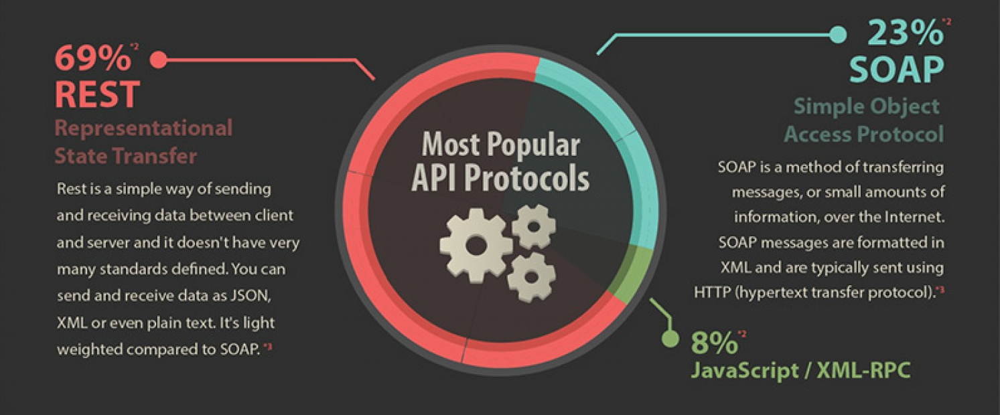
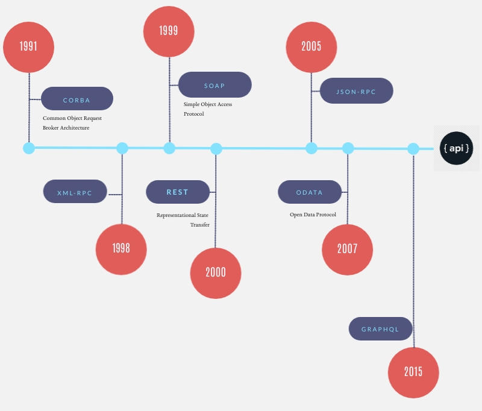
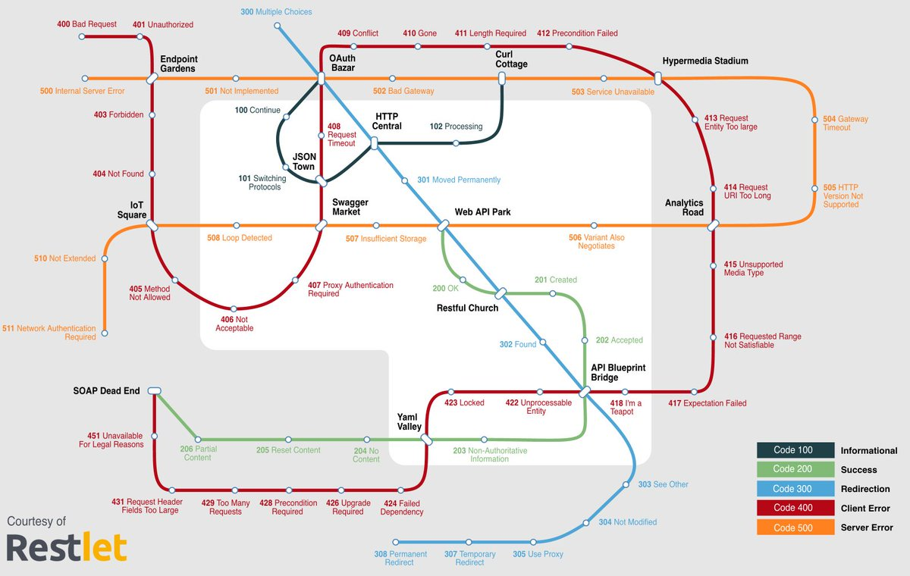
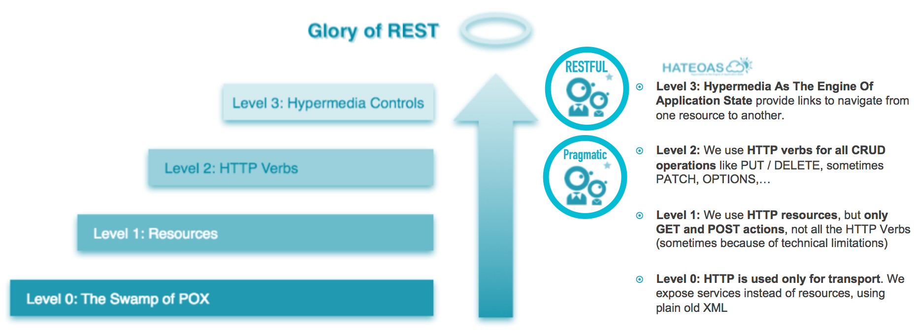
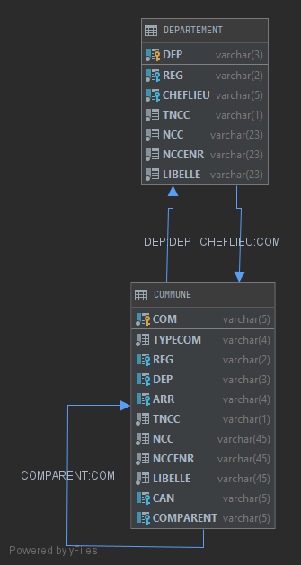
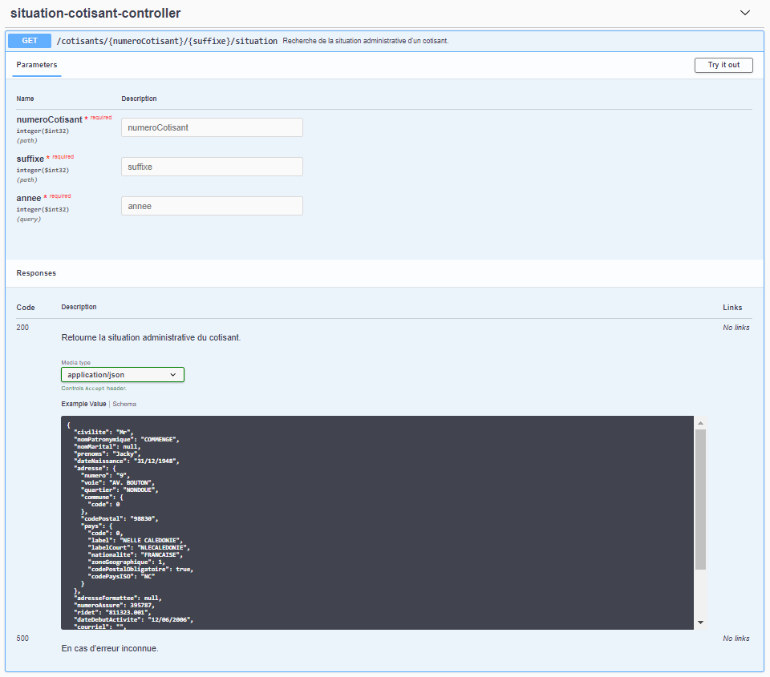

# Fondamentaux REST

- [Fondamentaux REST](#fondamentaux-rest)
  - [1. Les principes généraux](#1-les-principes-généraux)
    - [1.1 L'identification des ressources](#11-lidentification-des-ressources)
      - [1.1.1 Noms de domaines des API](#111-noms-de-domaines-des-api)
      - [1.1.2 Versioning](#112-versioning)
      - [1.1.3 Casse](#113-casse)
        - [1.1.3.1 URI](#1131-uri)
        - [1.1.3.2 Corps des requêtes et des réponses](#1132-corps-des-requêtes-et-des-réponses)
      - [1.1.4 Noms vs. Verbes](#114-noms-vs-verbes)
      - [1.1.5 Singulier vs. Pluriel](#115-singulier-vs-pluriel)
      - [1.1.6 Structure hiérarchique](#116-structure-hiérarchique)
    - [En résumé](#en-résumé)
    - [1.2 Gestion des erreurs](#12-gestion-des-erreurs)
      - [1.2.1 Succès](#121-succès)
      - [1.2.2 Erreurs côté client](#122-erreurs-côté-client)
      - [1.2.3 Erreurs côté serveur](#123-erreurs-côté-serveur)
  - [2 Pour une approche plus fine des requêtes de recherche (GET)](#2-pour-une-approche-plus-fine-des-requêtes-de-recherche-get)
  - [3 HATEOAS](#3-hateoas)
  - [4 Documenter les APIs REST](#4-documenter-les-apis-rest)
  - [5 Et plus généralement...](#5-et-plus-généralement)
  - [Annexes](#annexes)
    - [**Exemples** de règles de grammaire / d'audit](#exemples-de-règles-de-grammaire--daudit)
      - [Règles communes](#règles-communes)
      - [Règles REST](#règles-rest)
    - [**Exemple** de documentation OpenAPI v3](#exemple-de-documentation-openapi-v3)
      - [Format Json](#format-json)
      - [Avec Swagger UI](#avec-swagger-ui)


Les API REST - Representational State Transfert - sont de plus en plus populaires :



REST est exposé par Roy Thomas Fielding dans sa thèse de Doctorat de philosophie en information et informatique intitulé « [Architectural styles and the design of network-based software architectures](../resources/documents/fielding_dissertation.pdf) » publiée en 2000. 

Il a participé dès 1994 à la spécification du World Wide Web par sa participation aux groupes de travail sur URI, HTML et HTTP au sein de l’IETF (Internet Engineering Task Force). Il est également un des co-fondateurs du projet de serveur HTTP  Apache et est membre de l’Apache Software Foundation.

REST est une abstraction des éléments architecturaux d’un système réparti d’hypermédias. Ce modèle d’architecture s’appuie sur la description première de l’architecture du World Wide Web :
* modèle architectural client / serveur ;
* communication sans état ;
* possibilité de mettre en cache les réponses à des requêtes ;
  
Et y ajoute de nouvelles contraintes :
* une **interface uniforme** entre les différents composants de l’architecture caractérisée par :
   * l’**identification des ressources** ;
   * la **manipulation des ressources par des représentations** ;
   * des **messages auto descriptifs** ;
   * l’**hypermédia comme "moteur"** de l’application.
* un système en couches : **chaque composant ne peut « voir » au-delà de la couche immédiate avec laquelle il interagit** ;
* un modèle de code à la demande (facultatif) permettant l’extension des fonctionnalités d’un client par le biais de téléchargement et d’exécution de code sous forme d’applet ou de scripts.

**REST n’est pas un standard, il n’existe donc pas de spécification** (cf. [REST - Semantic Web Standards](https://www.w3.org/2001/sw/wiki/REST) _a discussion draft, with no formal status at W3C_). Il faut comprendre ce style d’architecture, puis concevoir des services web (ou des applications web) selon ce style.





Parmi les géants du Web, ce sont eBay, suivi par Amazon qui ont publié les premiers des APIs selon ce modèle (REST), puis Flickr...

## 1. Les principes généraux

Bien que REST ne soit pas un standard, il utilise des standards, en particulier :
* [URI](https://tools.ietf.org/html/rfc3986) comme syntaxe universelle pour adresser les **ressources** ;
* HTTP ([RFC7230](https://tools.ietf.org/html/rfc7230), [RFC7231](https://tools.ietf.org/html/rfc7231), [RFC7232](https://tools.ietf.org/html/rfc7232), [RFC7233](https://tools.ietf.org/html/rfc7233), [RFC7234](https://tools.ietf.org/html/rfc7234), [RFC7235](https://tools.ietf.org/html/rfc7235), [RFC7236](https://tools.ietf.org/html/rfc7236), [RFC7237](https://tools.ietf.org/html/rfc7237)) ;
* Les liens hypermédia ;
* les [types MIMES](https://www.iana.org/assignments/media-types/media-types.xhtml) ;
* ...

### 1.1 L'identification des ressources

L'identification des ressources est une question centrale dans la conception des API REST. Elle doit donc être clairement définie et partagée par tous. 
Ce sont ces règles d'identification qui vont garantir notamment la cohérence et l'homogénéité des APIs. Cet aspect est d'autant plus important lorsque lesdites APIs sont publiques.

#### 1.1.1 Noms de domaines des API

La publication de sous-domaines pour les APIs est surtout à prendre en compte lorsque celles-ci sont **publiques**. Par anticipation, il est possible de mettre en place les domaines suivants : 
* **production** : https://**api**.example.com
* **tests** : https://**api.sandbox**.example.com
  
  Pour ces deux premiers sous-domaines, il est également possible, lorsque les domaines métiers sont multiples et avec des APIs nombreuses, de les distinguer, mais jamais par domaines techniques !

* **portail développeurs** : https://**developers**.example.com

---
**A la Cafat...**

Il n'y pas encore, à priori, d'API publique.

---

#### 1.1.2 Versioning

La définition de l'architecture REST ne comporte aucun élément quant au versioning des APIs. Le versioning reste cependant un thème à part entière, notamment pour gérer l'évolutivité des services et donc des APIs proposées.

Il existe plusieurs solutions, communément admises :
* **Positionner le numéro de version de l'API, sur un digit (version majeure), au plus haut niveau du chemin de l'URI ;**
* Utiliser les en-têtes HTTP :
   * [_Accept_](https://www.w3.org/Protocols/rfc2616/rfc2616-sec14.html) : en utilisant la paramètre _level_
     
     Exemple :
     ```
     Accept: application/json;level=1
     ``` 
   * Utiliser un en-tête personnalisé, _Accept-version_.
     
     Exemple :
     ```
     Accept-version: v1
     ```
Pour sa simplicité de mise en oeuvre, c'est la **première solution** qui est très majoritairement utilisée. La numérotation retient **uniquement le numéro de version majeure**. Il faut donc définir les opérations qui sont à l'origine des changements de version, le plus souvent, il s'agit de **_breaking changes_**, notamment tout changement qui impacte directement les clients existants.

---
**A la Cafat...**

La gestion des versions des APIs est confondues avec le gestion des versions issues du cycle de développement et en particulier les numéros de version des livrables.

Par ailleurs, la distinction des différentes versions est faite dans le _contextPath_ et non le _basePath_.

La réunion de ces deux éléments impose le déploiement d'autant d'instances que de versions, sans compter l'éventuelle mise en haute disponibilité des APIs.
Chaque application cliente des APIs doit donc connaître explicitement la version des APIs qu'elle utilise.

La gestion actuelle des versions des APIs peut également avoir un impact sur l'utilisation d'un outil de _service discovery_.


---


#### 1.1.3 Casse

Il existe 3 types principaux de style de casse : 
- **C**amel**C**ase, décliné en :
    -  **l**ower**C**amel**C**ase et 
    -  **U**pper**C**amel**C**ase,
- snake_case (utilisation du **_underscore_** pour séparer les termes), et
- spinal-case (utilisation du **tiret** - _hyphen_ - pour séparer les termes).

##### 1.1.3.1 URI

La [RFC 3986](https://www.ietf.org/rfc/rfc3986.txt) définie **les URIs sensibles à la casse**, sauf pour le protocole (_scheme_) et l'hôte dans la partie domaine (_authority_).

**Il faut donc préférer l'écriture des URIs en minuscules.**

Pour séparer les termes d'une expression, il reste possible d'utiliser soit l'underscore (snake_case), soit le tiret (spinal-case).

Pour une simple question de facilité de lecture et de visibilité des caractères, **il est préférable d'utiliser** le tiret, donc **la notation spinal-case**.

---
**A la Cafat...**

cf. [BP-REST : Convention sur la casse d'une URL REST](https://atlas-prd-01.intra.cafat.nc/confluence/display/PD/BP-REST+%3A+Convention+sur+la+casse+d%27une+URL+REST)

Les recommandations de la Cafat imposent le **spinal-case** mais la règle n'est pas respectée (grande hétérogénéité).

---

##### 1.1.3.2 Corps des requêtes et des réponses

Sur la base des règles, imposées ou de fait, d'un grand nombre de langage de programmation, dont Java, JavaScript, etc., il est recommandé d'utilisé la notation lowerCamelCase.

---
**A la Cafat...**

cf. [BP-REST : Comment passer des paramètres en REST ?](https://atlas-prd-01.intra.cafat.nc/confluence/pages/viewpage.action?pageId=39888147), et 
[BP-REST : Que doit renvoyer un service REST ?](https://atlas-prd-01.intra.cafat.nc/confluence/pages/viewpage.action?pageId=39888145)

Les recommandations de la Cafat imposent :
- le camelCase, plus précisèment le lowerCamelCase (cf. exemples), et
- la représentation des ressources au format JSON (par défaut !)

Elles précisent par ailleurs le cadre d'utilisation du _path_, des _query string_ et du _request body_

---


#### 1.1.4 Noms vs. Verbes

Il s'agit ici d'identifier des ressources et non des actions sur lesdites ressources par opposition aux systèmes RPC, voire SOAP... Il convient donc d'utiliser des noms et non des verbes. Il faut utiliser des noms significatifs et éviter les acronymes. Les actions effectuées sur ces mêmes ressources seront portées par la méthode HTTP utilisée par la requête, en particulier pour les opérations CRUD :

 Operation  | méthode HTTP   | Commentaire(s) 
----------- | -------------- | ----------------
 Création | POST | Pour créer une instance dans une collection si l'identifiant de l'instance est inconnu. L'identification (l'URI) de la ressource nouvellement créée figure dans l'attribut _Location:_ de la réponse HTTP
 Création | PUT | Uniquement lorsque l'identifiant de la nouvelle ressource est fourni par le client dans la requête HTTP
 Recherche | GET | Pour la recherche d'une collection ou d'une instance dans une collection
 Mise à jour | PUT | Pour une mise à jour complète
 Mise à jour | PATCH | pour une mise à jour partielle
 Suppression | DELETE | Pour une suppression

 Les méthodes HTTP _HEAD_ et _OPTIONS_ peuvent être utilisées en particulier pour :
 - tester si une ressource existe et est accessible (_HEAD_, _OPTIONS_),
 - si elle a changé (_HEAD_)
 - quelles actions sont possibles sur la ressource en question (_OPTIONS_),
 - récupérer d'éventuelles métadonnées (_HEAD_)

Ces deux méthodes ont pour particularité de ne pas retourner de représentation de la ressource au client.

Il est malgré tout possible qu'il reste dans les APIs des logiques d'opérations. Dans ce dernier cas, il convient d'utiliser une requête _POST_ et de considérer une URI qui se terminera par le verbe identifiant l'opération à effectuer.

---
**A la Cafat...**

cf. [BP-REST : Convention sur le verbe HTTP d'un service REST](https://atlas-prd-01.intra.cafat.nc/confluence/display/PD/BP-REST+%3A+Convention+sur+le+verbe+HTTP+d%27un+service+REST)

Les recommandations de la Cafat sont globalement conformes aux principes d'architecture REST sauf pour les méthodes _POST_ et _PUT_.
_POST_ ne devrait être utilisé que pour la création, et _PUT_ pour la création si l'identifiant de la ressource est connu à priori ou pour la mise à jour complète de la ressource.

Par ailleurs, dans le premier exemple relatif à la méthode GET, si la _cotisation_ est une ressource pouvant être représentée, cela devrait être  `/personne-physique/1/cotisant/1002003/cotisation/calculer`


---

#### 1.1.5 Singulier vs. Pluriel

Quelle que soit la règle mise en place, elle doit être appliquée systématiquement pour faciliter :
- l'_explorabilité_ de l'API, et
- sa logique naturelle de lecture

Il est donc recommandé d'utiliser les noms au pluriel.

Exemple : 
`/countries/{id}` renvoie un pays (instance) choisi dans la liste (collection) des pays

---
**A la Cafat...**

cf. [BP-REST : Convention de nommage d'une ressource](https://atlas-prd-01.intra.cafat.nc/confluence/display/PD/BP-REST+%3A+Convention+de+nommage+d%27une+ressource)

Il y a de grandes différences issues de la non application de cette règle.

---

#### 1.1.6 Structure hiérarchique

La profondeur de la structure hiérarchique ne devrait pas dépasser deux niveaux, aussi bien au niveau des URIs d'identification des ressources, qu'au niveau des corps de requêtes et de réponses.

Exemple : 
URI : 
```
/countries/DEU/regions
/countries/DEU/regions/Saarland
```
Corps (Json)
```
{
   "shortName": "Germany",
   "fullName": "Germany",
   "alpha2": "DE",
   "alpha3": "DEU",
   "numeric": "276",
   "regions": [
      {
         "name": "Saarland",
         (...)
      },
      (...)
   ]
}
```

---
**A la Cafat...**

Il n'y a pas de recommandation sur ce point précis.

A vérifier pour certains services d'APIs _legacy_

---

### En résumé

Ces recommandations permettent d'identifier et de manipuler les ressources dans une grande majorité de cas.

Exemple d'URI selon les principes ennoncés :
```
https://api.example.com/v1/countries/DEU/regions
https://api.example.com/geolocation/v1/countries/DEU/regions
https://api.geolocation.example.com/v1/countries/DEU/regions
```

**Quelle que soient les règles, il faut les appliquer systématiquement pour assurer la cohérence, l' homogénéité, l' "explorabilité" et la lisibilité des APIs fournies aux développeurs et / ou aux clients.**

**Globalement, l'ensemble des règles déjà en place à la Cafat ne sont pas systématiquement appliquées. Il en résulte un manque flagrant d'homogénéité dans l'identification et la manipulation des ressources.**

---

### 1.2 Gestion des erreurs

Il existe plusieurs solutions, mais un consensus s'est formé autour de l'utilisation des [codes de statut HTTP](https://www.iana.org/assignments/http-status-codes/http-status-codes.xhtml).



Parmi les plus utilisés, on peut citer : 

#### 1.2.1 Succès
 Code statut HTTP | Description
  --- | ---
  200 Ok | Code générique de succès de l'exécution d'un requête, notamment sur les recherches (GET) et les mises à jour (PUT, PATCH)
  201 Created | En réponse à la création d'une ressource (POST, PUT)
  202 Accepted | Dans un cadre asynchrone, indique que la requête est bien prise en compte pour traitement ultérieur
  204 No Content | En réponse à une suppression (DELETE) ou à une recherche (GET) dont les critères ne permettent pas d'avoir une réponse avec contenu.
  206 Partial Content | En réponse à une recherche (GET) paginée (cf. HATEOAS)
 
 #### 1.2.2 Erreurs côté client
 Code statut HTTP | Description
  --- | ---
  400 Bad Request | Code générique face à l'impossibilité de traiter une requête
  401 Unauthaurized | lorsque l'utilisateur n'est pas identifié
  403 Forbidden | Lorsque l'utilisateur, bien qu'authentifié, ne dispose pas des droits suffisants pour accèder à cette ressource
  404 Not Found | La ressource demandée n'existe pas
  405 Method Not Allowed | Lorsque la méthode n'est pas applicable à la ressource ou lorsque l'utilisateur n'est pas autorisé à utiliser cette méthode sur la ressource
  406 Not Acceptable | incompatibilité de la requête au regard des en-têtes HTTP Accept-*
  
  #### 1.2.3 Erreurs côté serveur
 Code statut HTTP | Description
  --- | ---
  500 Internal Server Error | Une erreur côté serveur que le client ne peut pas traiter

L'utilisation du code statut HTTP, si elle ne suffit pas, **peut** être compléter par une structure d'information sur l'erreur en question incluse dans le corps de la réponse (cf. pour exemple la spéc. OAuth2 : [RFC 6749](https://tools.ietf.org/html/rfc6749#section-5.2)) : 
```
{
    "$schema": "http://json-schema.org/draft-04/schema#",
    "type": "object",
    "properties": {
        "error": {
            "type": "string"
        },
        "errorDescription": {
            "type": "string"
        },
        "errorUri": {
            "type": "string"
        }
    },
    "required": [
        "error"
    ]
}
```

Cette structure, s'il n'y a pas d'erreur dans la manipulation de la ressource, ne doit pas être visible dans la réponse.

---
**A la Cafat...**

Les recommandations sont conformes aux principes REST mais il n'y a pas d'homogénéité sur l'utilisation d'une structure d'information d'erreur(s).

---


## 2 Pour une approche plus fine des requêtes de recherche (GET)

Pour les recherches, il faut utiliser la partie _query string_ de l'URI. Ici aussi, il convient d'utiliser la règle définie sur l'ensemble de l'API pour être homogène et cohérent sur l'ensemble de ladite API.

Lorsque la recherche est faite sur une collection ou sur une instance d'une collection, on parlera de **filtre**. Elle sera sous la forme : 
```
countries/search?group=europe
```

Si la recherche est multi-ressources (ou globale), on parle de recherche multi-critères. Elle sera sous la forme : 
```
/search?q=country+germany
```

Par ailleurs, les résultats des recherches devraient, le cas échéant, être paginés. L'introduction de la pagination va de facto introduire des mots clés réservés qui ne seron plus utilisables par ailleurs dans l'URI, en général : 
- *__first__*,
- *__last__*,
- *__count__*,
- *__sort__*,
- *__desc__*

Il faudra aussi adapter l'utilisation des codes statut HTTP avec le code *__206 Partial Content__*

---
**A la Cafat...**

Cf. [BP-REST : Comment passer des paramètres en REST ?](https://atlas-prd-01.intra.cafat.nc/confluence/pages/viewpage.action?pageId=39888147)

Il n'y a pas de précision lorsqu'il s'agit d'opérations (et non de ressources ou de propriétés de ressources).

---


## 3 HATEOAS 

**ou le Saint Graal REST**

Leonard Richardson a développpé un modèle de maturité dans l'adoption du style d'architecture REST ([QCon 2008](http://www.crummy.com/writing/speaking/2008-QCon/act3.html)) :



Hypermedia As The Engine Of Application State (HATEOAS) tend à adresser les parts hypermédia et autodescriptive (ou auto-découverte) dans la mise en place d'une API.
Les interactions entre un client de l'API et l'API elle-même sont rendues possibles par les liens hypermédia fournis pour chaque ressource interrogée.

HATEOAS s'appuie sur :
- la possibilité de mettre en place des modèles de représentation des ressources (Model, Preview, Assembler),
- la [normalisation dans la construction des liens hypermedia (HAL)](https://tools.ietf.org/html/draft-kelly-json-hal-08)
- l'autodécouverte des API au travers de métadonnées : [Application Level Profile Semantics (ALPS)](https://tools.ietf.org/html/draft-amundsen-richardson-foster-alps-02)

Exemple : 

Pour un modèle de données partiel relatif au [code officiel géographique](https://www.insee.fr/fr/information/2560452) : 



L'interrogation de l'API `/api/v1/departements/59`, avec le modèle HATEOAS, retourne :

- représentation de la ressource (HAL) :
  
```
{
  "dep" : "59",
  "tncc" : "2",
  "ncc" : "NORD",
  "nccenr" : "Nord",
  "libelle" : "Nord",
  "_links" : {
    "self" : {
      "href" : "http://localhost:8080/api/v1/departements/59"
    },
    "departement" : {
      "href" : "http://localhost:8080/api/v1/departements/59"
    },
    "cheflieu" : {
      "href" : "http://localhost:8080/api/v1/departements/59/cheflieu"
    },
    "communes" : {
      "href" : "http://localhost:8080/api/v1/departements/59/communes"
    }
  }
}
```

La commune chef lieu de département, ainsi que la liste des communes du département ne figurent pas dans la réponse, mais des liens sont fournis par l'API pour obtenir la représentation de ces ressources.

- méta-données (ALPS) sur `/api/v1/profile/departements` :

```
  {
    "alps": {
        "version": "1.0",
        "descriptor": [
            {
                "id": "departement-representation",
                "href": "http://localhost:8080/api/v1/profile/departements",
                "descriptor": [
                    {
                        "name": "dep",
                        "type": "SEMANTIC"
                    },
                    {
                        "name": "tncc",
                        "type": "SEMANTIC"
                    },
                    {
                        "name": "ncc",
                        "type": "SEMANTIC"
                    },
                    {
                        "name": "nccenr",
                        "type": "SEMANTIC"
                    },
                    {
                        "name": "libelle",
                        "type": "SEMANTIC"
                    },
                    {
                        "name": "cheflieu",
                        "type": "SAFE",
                        "rt": "http://localhost:8080/api/v1/profile/communes#commune-representation"
                    },
                    {
                        "name": "communes",
                        "type": "SAFE",
                        "rt": "http://localhost:8080/api/v1/profile/communes#commune-representation"
                    }
                ]
            },
            {
                "id": "get-departements",
                "name": "departements",
                "type": "SAFE",
                "descriptor": [],
                "rt": "#departement-representation"
            }
        ]
    }
}
```

Remarque :
S'agissant de données de références, il n'y a dans cet exemple que le GET d'autorisé.

---
**A la Cafat...**

La Cafat pourrait être positionné au niveau 2 du modèle de maturité de Richardson et n'est donc pas concernée, pour l'instant, par ce point.

---

## 4 Documenter les APIs REST

La question de documenter les APIs reste entière et il existe notamment un débat sur sa nécessité lorsque celles-ci sont fournies selon le plus haut niveau de maturité du modèle de Richardson (Niveau 3 : HATEOAS).

Néanmoins, cette documentation doit être envisagée, au-delà de la lisibilité de l'API pour les développeurs, également pour sa testabilité (via Swagger, CURL...), en particulier pour les APIs publiques.

Si ce domaine est longtemps resté un lieu d'expérimentation (et de compétition), c'est désormais le format [OpenAPI v3](http://spec.openapis.org/oas/v3.0.3), initialement porté par le projet [swagger](https://swagger.io/), qui est adopté, y compris par les géants du Web. Le format OpenAPI est porté par le consortium [OpenAPI initiative](https://www.openapis.org) sous l'égide de la _Linux Foundation_.

Il faut ici aussi distinguer le format de documentation des outils.
Il existe ainsi d'autres formats dont par exemple [api blueprint](https://apiblueprint.org/), [RAML](https://raml.org/)... Et il existe aussi plusieurs outils, dont par exemple [swagger](https://swagger.io/), [RAML](https://raml.org/)...

Les outils permettent d'avoir une approche : 
-  _top /down_, i.e. c'est la description de l'API via sa documentation qui va permettre de générer le code (stubs et SDK client), par exemple [swagger codeGen](https://swagger.io/tools/swagger-codegen/)
- _bottom / up_, i.e. la documentation est générée de manière statique ou dynamique à partir du code (annotations dans le code source Java, à partir de l'exécution de tests, etc.).

---
**A la Cafat...**

La Cafat n'a pas émis de recommandations pour la documentation des ses APIs mais a cependant mis en place le format swagger 2.0.


---


## 5 Et plus généralement...

_**keep it simple, stupid**_ :
* N'importe quel développeur devrait pouvoir utiliser une API sans être obligé de se référer à la documentation. Mais si l'API est bien documentée, c'est mieux !
* Une API doit être conçue pour les applications clientes, elle peut donc dénormaliser le modèle de données auquel elle se rapporte.
* Les opérations de manipulation des ressources sont uniques
* L'identification des ressources doit utiliser des termes concrets et partagés par tous les acteurs (cf. _ubiquitous language_ dans [Domain-Driven Design: Tackling Complexity in the Heart of Software, Eric Evans, 2003](https://www.amazon.com/gp/product/0321125215?ie=UTF8&tag=martinfowlerc-20&linkCode=as2&camp=1789&creative=9325&creativeASIN=0321125215))
* Développer d'abord les cas d'utilisations _passants_, mais sans oublier qu'il faudra adresser les cas d'utilisations _non passants_.

---
**A la Cafat...**

La Cafat a entamé un travail de normalisation des développements de ces APIs REST, cf. [REST - Bonnes pratiques](https://atlas-prd-01.intra.cafat.nc/confluence/display/PD/REST).

La Cafat devrait préciser et formaliser sa "grammaire" (ses bonnes pratiques) REST de manière plus précise et selon le modèle de la [RFC2119 - Key words for use in RFCs to Indicate Requirement Levels](https://www.ietf.org/rfc/rfc2119.txt).

Au delà de la définition d'une grammaire REST, il faut aussi qu'elle soit partagée, connue et enrichie par les développeurs au fur et à mesure de la capitalisation sur ce type de développement.

Il faut bien sûr qu'elle soit appliquée et sa mise en oeuvre doit être vérifiée. Il n'existe cependant pas de solution automatisée et seules les revues de code, notamment lors des _pull requests_ permettent cette vérification.

En dehors des règles de grammaire, il est nécessaire de revoir le mode de gestion des versions des APIs REST. En particulier il faut séparer le versioning des APIs du versioning des livrables pour revenir dans les standards REST.

---

## Annexes

### **Exemples** de règles de grammaire / d'audit

#### Règles communes

Numéro | Règle | Niveau | Procédure | Correction | Commentaires
--- | --- | --- | --- | --- | ---
1 | Les branches mergées doivent être supprimées | **SHOULD** | Vérifier l'existence de branches marquées *merged* dans le gestionnaire de code source | Supprimer les branches mergées | Une branche mergée indique que le travail sur cette branche est terminé et que la branche a été rabattue. Il n'y a donc plus lieu de travaillé sur cette branche dont la conservation porte à confusion.
2 | Le code source poussé sur le gestionnaire de code source ne contient pas de fichier lié à l'IDE | **MAY** | Vérifier que le fichier propre aux IDE sont inscrits dans le fichier `.gitignore` | Supprimer les fichiers concernés dans le gestionnaire de code source **ET** ajouter les *patterns* d'exclusion dans le fichier `.gitignore` | Les projets ne doivent pas être liés à un IDE en particulier. Les développeurs peuvent choisir un IDE en fonction de leur préférence, de leur status (prestataire externe, etc...)
3 | Tout projet doit contenir un fichier **README.md** au format [Markdown](https://daringfireball.net/projects/markdown/) | **MUST** | Vérifier la présence du fichier `README.md` | Ajouter le fichier `README.md` | Le fichier README contient tous les éléments (cf règle #?) nécessaires à la prise en main du projet par un développeur.
...

#### Règles REST

Numéro | Règle | Niveau | Procédure | Correction | Commentaires
--- | --- | --- | --- | --- | ---
1 | Les URIs des *endpoints* doivent être versionnés | **MUST** | Vérifier les URIs déclarées dans les *Controller* | Ajouter le numéro de version de l'API | Les endpoints doivent être préfixés par /api/**vX** où X est le numéro de version, sur un seul digit, relatif à la version majeure de l'API. Le but est d'assurer une visibilité sur l'évolution de l'API aux utilisateurs de ladite API (changements dans les structures de représentation (request / response), suppression / ajout de *endpoint(s)*, etc. ).
2 | Les *endpoints* doivent accepter et retourner du JSON | **MUST** | Vérifier que les *controllers* ne surcharge pas le comportement par défaut (*consumes* et *produces*) par autre chose que du JSON. ATTENTION, la présence de la dépendance `jackson-dataformat-xml` dans le projet entraîne des échanges par défaut au format XML. Dans ce dernier cas, la déclaration des échanges au format JSON doit être explicite. | Déclarer explicitement le support des echanges au format JSON (*consumes* et *produces*) | Se conformer aux standards REST et homogénéiser les APIs (notamment pour les APIs publiques)
...

### **Exemple** de documentation OpenAPI v3

#### Format Json

```
 "openapi": "3.0.1",
    "info": {
        "title": "Recouvrement - Déclaration de Ressources Anuuelles API",
        "license": {
            "name": "Apache 2.0",
            "url": "http://www.apache.org/licenses/LICENSE-2.0"
        },
        "version": "V0"
    },
    "servers": [
        {
            "url": "https://api-int.intra.cafat.nc/s-rec-dra-2.0"
        }
    ],
    "paths": {
        "/cotisants/{numeroCotisant}/{suffixe}/situation": {
            "get": {
                "tags": [
                    "situation-cotisant-controller"
                ],
                "summary": "Recherche de la situation administrative d'un cotisant.",
                "operationId": "getSituation",
                "parameters": [
                    {
                        "name": "numeroCotisant",
                        "in": "path",
                        "required": true,
                        "schema": {
                            "type": "integer",
                            "format": "int32"
                        }
                    },
                    {
                        "name": "suffixe",
                        "in": "path",
                        "required": true,
                        "schema": {
                            "type": "integer",
                            "format": "int32"
                        }
                    },
                    {
                        "name": "annee",
                        "in": "query",
                        "required": true,
                        "schema": {
                            "type": "integer",
                            "format": "int32"
                        }
                    }
                ],
                "responses": {
                    "500": {
                        "description": "En cas d'erreur inconnue."
                    },
                    "200": {
                        "description": "Retourne la situation administrative du cotisant.",
                        "content": {
                            "application/json": {
                                "schema": {
                                    "$ref": "#/components/schemas/SituationCotisantDTO"
                                },
                                "example": "{\n  \"civilite\": \"Mr\",\n  \"nomPatronymique\": \"COMMENGE\",\n  \"nomMarital\": null,\n  \"prenoms\": \"Jacky\",\n  \"dateNaissance\": \"31/12/1948\",\n  \"adresse\": {\n    \"numero\": \"9\",\n    \"voie\": \"AV. BOUTON\",\n    \"quartier\": \"NONDOUE\",\n    \"commune\": {\n      \"code\": 0\n    },\n    \"codePostal\": \"98830\",\n    \"pays\": {\n      \"code\": 0,\n      \"label\": \"NELLE CALEDONIE\",\n      \"labelCourt\": \"NLECALEDONIE\",\n      \"nationalite\": \"FRANCAISE\",\n      \"zoneGeographique\": 1,\n      \"codePostalObligatoire\": true,\n      \"codePaysISO\": \"NC\"\n    }\n  },\n  \"adresseFormattee\": null,\n  \"numeroAssure\": 395787,\n  \"ridet\": \"811323.001\",\n  \"dateDebutActivite\": \"12/06/2006\",\n  \"courriel\": \"\",\n  \"telephone\": [\n    \"963045\"\n  ],\n   \"profession\": [\n    {\n      \"codeProfession\": \"string\",\n      \"libelleProfession\": \"string\"\n    }\n  ],}"
                            }
                        }
                    }
                }
            }
        },
      (...)
``` 

#### Avec Swagger UI

