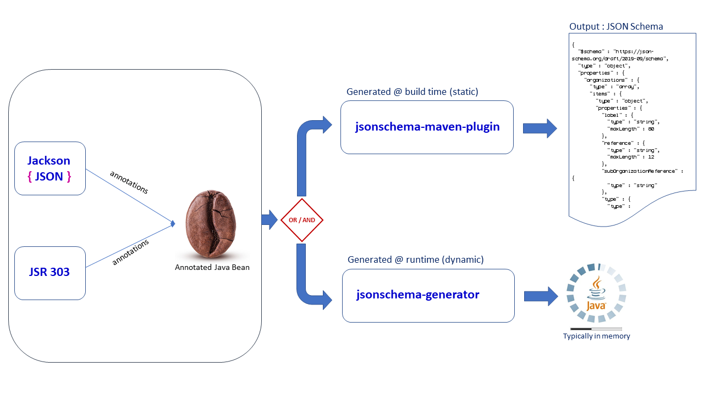
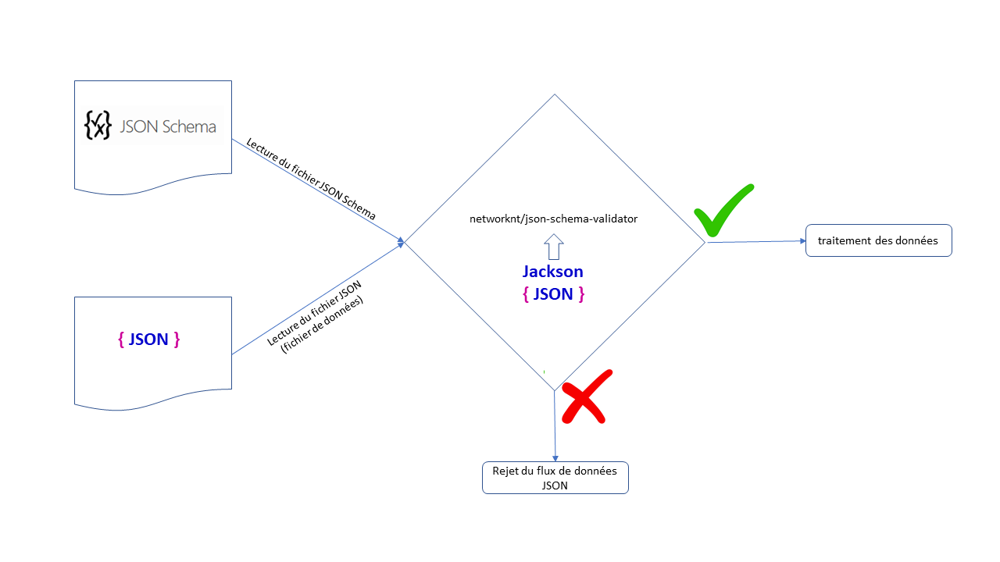

## Validation d'un flux d'échange au format JSON

- [Validation d'un flux d'échange au format JSON](#validation-dun-flux-déchange-au-format-json)
  - [Références :](#références-)
  - [Objectifs :](#objectifs-)
  - [Choix des outils](#choix-des-outils)
  - [Principe de fonctionnement :](#principe-de-fonctionnement-)
    - [Génération du schéma :](#génération-du-schéma-)
      - [@ build time](#-build-time)
      - [@ runtime](#-runtime)
    - [Validation](#validation)

### Références : 
- [The home of JSON Schema](https://json-schema.org/)
- [JSR 303 Bean Validation](https://docs.monext.fr/download/attachments/808123498/bean_validation-1_0-final-spec.pdf?version=1&modificationDate=1625822343000&api=v2)

### Objectifs :
Cf. le § Benefits de la page [The home of JSON Schema](https://json-schema.org/)

### Choix des outils

Le choix de la version de la spécification JSON Schema utilisée tient compte des implémentations existantes et pour la génération du schéma, et pour la validation d'objets JSON selon le même schéma précédemment généré :

Validation :

| JSON Schéma spec version -> | 2020-12 | 2019-09 (Draft 08) | Draft-07 | Draft-06 | Oldest |
|-----|-----|-----|-----|-----|-----|
| [Snow](https://github.com/ssilverman/snowy-json) | :white_check_mark: | :heavy_check_mark: | :heavy_check_mark: | :heavy_check_mark: | :white_check_mark: |
| [Vert.x Json Schema](https://github.com/eclipse-vertx/vertx-json-schema) | :white_check_mark: | :heavy_check_mark: | :heavy_check_mark: | :white_check_mark: | :white_check_mark: |
| [everit.org](https://github.com/everit-org/json-schema) | :white_check_mark: | :white_check_mark: | :heavy_check_mark: | :heavy_check_mark: | :heavy_check_mark: |
| [Justify](https://github.com/leadpony/justify) | :white_check_mark: | :white_check_mark: | :heavy_check_mark: | :heavy_check_mark: | :heavy_check_mark: |
| [networknt/json-schema-validator](https://github.com/networknt/json-schema-validator) | :white_check_mark: | :heavy_check_mark: | :heavy_check_mark: | :heavy_check_mark: | :heavy_check_mark: |
| [jsonschemafriend](https://github.com/jimblackler/jsonschemafriend) | :white_check_mark: | :heavy_check_mark: | :heavy_check_mark: | :heavy_check_mark: | :heavy_check_mark: |

Les librairies retenues pour :
- la **génération** du schéma JSON : 
  - @ build time : [jsonschema-maven-plugin](https://github.com/victools/jsonschema-generator/tree/master/jsonschema-maven-plugin)
  - @ runtime : [jsonschema-generator](https://github.com/victools/jsonschema-generator/tree/master/jsonschema-generator)
- la **validation** : [networknt/json-schema-validator](https://github.com/networknt/json-schema-validator)


### Principe de fonctionnement :

#### Génération du schéma :



##### @ build time

Avec Maven (Cf. la [documentation officielle](https://victools.github.io/jsonschema-generator/#introduction) pour les options): 

```xml
    <build>
        <plugins>
            (...)
            <!-- JSON Schema generation @ build time -->
            <plugin>
                <groupId>com.github.victools</groupId>
                <artifactId>jsonschema-maven-plugin</artifactId>
                <version>4.18.0</version>
                <executions>
                    <execution>
                        <goals>
                            <goal>generate</goal>
                        </goals>
                    </execution>
                </executions>
                <configuration>
                    <classNames>full.qualified.name.to.ClassName</classNames>
                    <schemaFilePath>src/main/resources/schemas</schemaFilePath>
                    <schemaFileName>{0}.schema.json</schemaFileName>
                    <schemaVersion>DRAFT_2019_09</schemaVersion>
                    <options>
                        <preset>PLAIN_JSON</preset>
                        <enabled>
                            <option>PLAIN_DEFINITION_KEYS</option>
                            <option>SCHEMA_VERSION_INDICATOR</option>
                            <option>FORBIDDEN_ADDITIONAL_PROPERTIES_BY_DEFAULT</option>
                        </enabled>
                    </options>
                    <modules>
                        <module>
                            <name>Jackson</name>
                            <options>
                                <option>RESPECT_JSONPROPERTY_REQUIRED</option>
                                <option>FLATTENED_ENUMS_FROM_JSONVALUE</option>
                            </options>
                        </module>
                        <module>
                            <name>JavaxValidation</name>
                            <options>
                                <option>INCLUDE_PATTERN_EXPRESSIONS</option>
                            </options>
                        </module>
                    </modules>
                </configuration>
            </plugin>
        </plugins>
    </build>
```

##### @ runtime

Ajout de la dépendance (Maven) dans la section <DependencyManagement /> avec le scope import : 
```XML
        <dependency>
            <groupId>com.github.victools</groupId>
            <artifactId>jsonschema-generator-parent</artifactId>
            <version>{jsonschema-generator-parent.version}</version>
        </dependency>
```

ou des dépendances explicites (core et module(s)) :
```XML
        <dependency>
            <groupId>com.github.victools</groupId>
            <artifactId>jsonschema-generator</artifactId>
            <version>{jsonschema-generator.version}</version>
        </dependency>
        <dependency>
            <groupId>com.github.victools</groupId>
            <artifactId>jsonschema-module-jackson</artifactId>
            <version>{jsonschema-generator.version}</version>
        </dependency>
        <dependency>
            <groupId>com.github.victools</groupId>
            <artifactId>jsonschema-module-javax-validation</artifactId>
            <version>{jsonschema-generator.version}</version>
        </dependency>
```

Code Java : 
```java
        (...)
        JavaxValidationModule javaxValidationModule = new JavaxValidationModule(JavaxValidationOption.INCLUDE_PATTERN_EXPRESSIONS);
        JacksonModule jacksonModule = new JacksonModule(JacksonOption.RESPECT_JSONPROPERTY_REQUIRED, JacksonOption.FLATTENED_ENUMS_FROM_JSONVALUE);
        SchemaGeneratorConfigBuilder builder = new SchemaGeneratorConfigBuilder(SchemaVersion.DRAFT_2019_09, OptionPreset.PLAIN_JSON).with(Option.PLAIN_DEFINITION_KEYS,
                Option.SCHEMA_VERSION_INDICATOR, Option.FORBIDDEN_ADDITIONAL_PROPERTIES_BY_DEFAULT).with(javaxValidationModule).with(jacksonModule);
        SchemaGeneratorConfig config = builder.build();
        SchemaGenerator generator = new SchemaGenerator(config);
        JsonNode schema = generator.generateSchema(ClassName.class);
        (...)
```


#### Validation



Ajout de la dépendance (Maven) : 
```XML
        <dependency>
            <groupId>com.networknt</groupId>
            <artifactId>json-schema-validator</artifactId>
            <version>{json-schema-validator.version}</version>
        </dependency>
```

Code Java : 
```java
this.objectMapper = new ObjectMapper();
        final JsonSchema schema = JsonSchemaFactory.builder(JsonSchemaFactory.getInstance(SpecVersion.VersionFlag.V201909)).objectMapper(this.objectMapper).build().getSchema(
                jsonSchema);
        final JsonNode node = this.objectMapper.readTree(jsonContent);
        return schema.validate(node);
```


