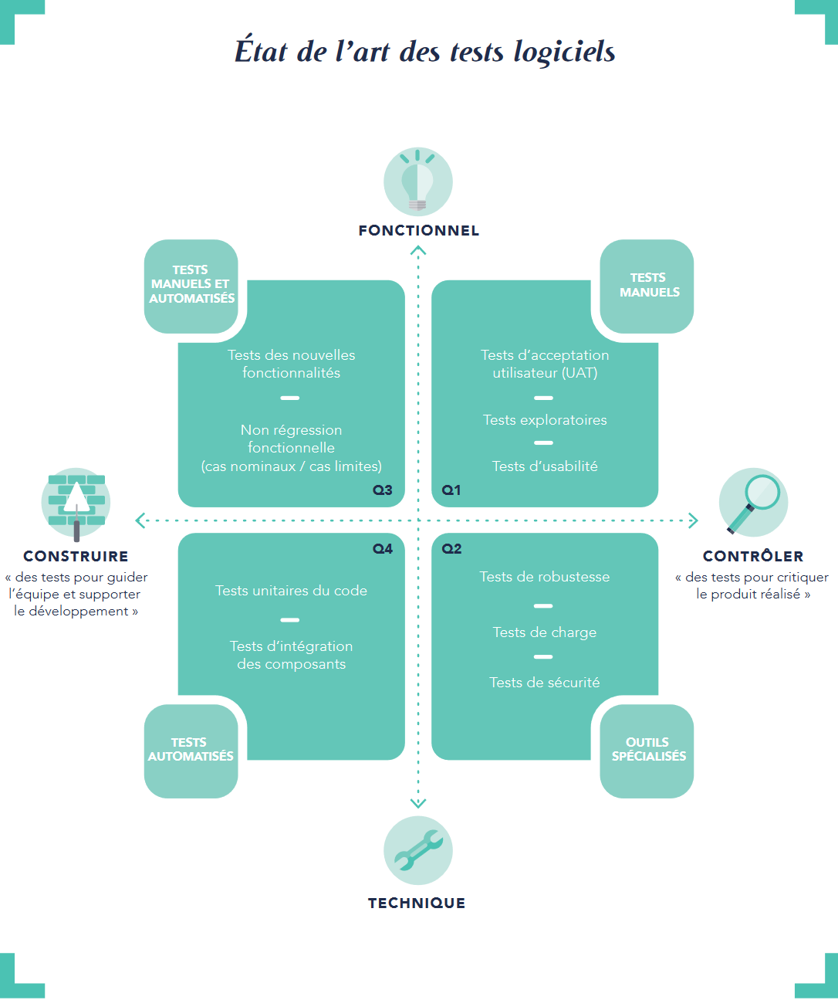

# Testing

[Retour](../README.md)

### Quels sont les différents types de test ?

**Réponse attendues** :
Cf. 

Pour un profil développeur, les types de tests de la partie gauche du quadrant devraient être connus. C'est par ailleurs ces tests qui sont automatisables et reproductibles (CI):

|  Type  |  Granularité  |  Complexité  |  Coût  |
| --- | --- | --- | --- |
| Unitaire | Très fine : une unité logique de code | Très simple | *x*Unit |
| Intégration | Une partie de l'application regroupant plusieurs unités logiques de code | simple | *x*Unit |
| Architecture | Fonction de la portée des tests | simple | archUnit |
| De bout en bout (e2e) | Application complètement intégrée | Complexe | TestCafe... |
| Montée en charge | A l'image de la production | Complexe | Outillage spécialisé |

il y a aussi les tests bouchonnés --> Mockito...